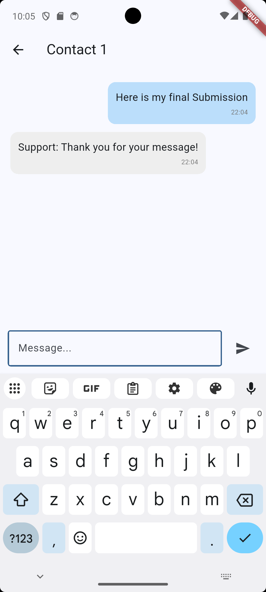
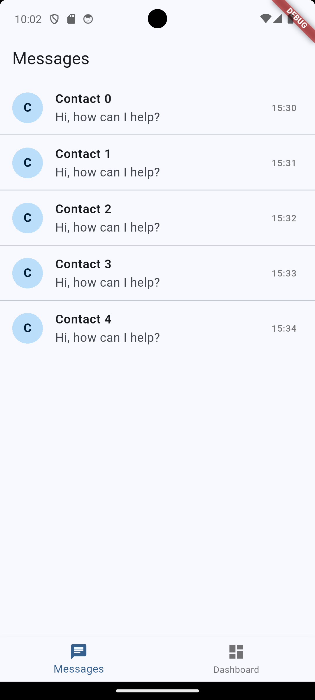
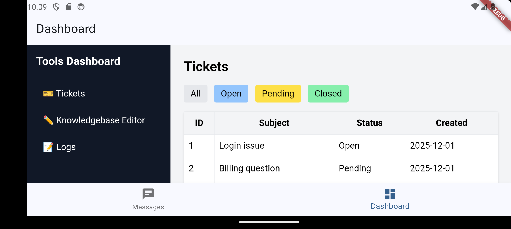
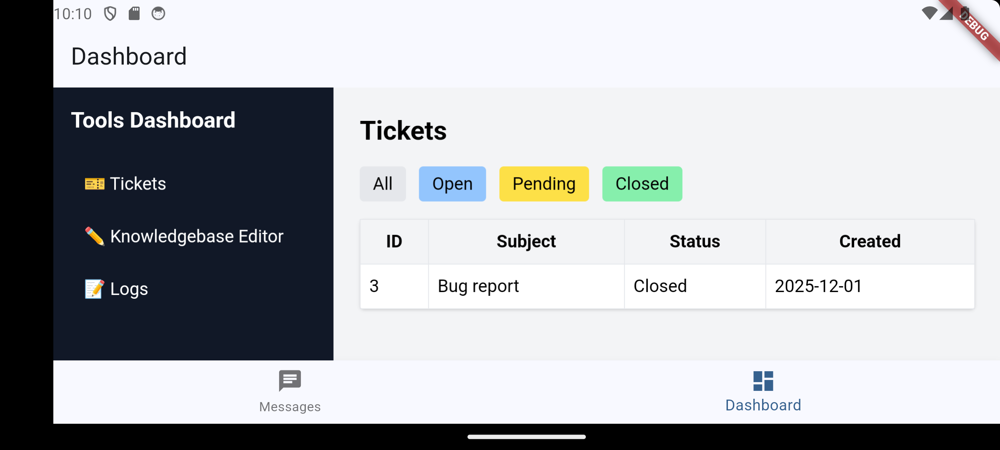
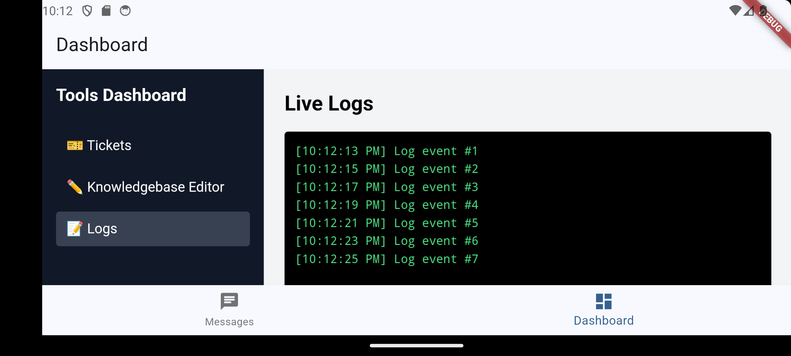

# 📦 Takehome Assessment — Flutter + Angular

This project contains both required applications for the take-home assessment:

- **Flutter Mobile App** (loads the Angular dashboard through WebView)
- **Angular Dashboard** (Tickets, Knowledgebase Editor, Logs)

Both follow the folder structure outlined in the PDF.

---

## 📁 Folder Structure

```
assessment/
├── flutter_app/
│   └── takehome_app/        # Complete Flutter application
│
└── dashboard/               # Angular dashboard application
```

---

## 🚀 Flutter App

The Flutter app includes:

- A bottom navigation bar  
- A Messages screen  
- A Dashboard tab that loads the Angular dashboard through WebView  
- Cleartext + `<usesCleartextTraffic>` enabled  
- Angular loaded using the correct Android emulator IP  

### Run the Flutter App

```sh
cd flutter_app/takehome_app
flutter pub get
flutter run
```

### Important — Dashboard Connection

Angular must be running on:

```
http://10.0.2.2:4200
```

This is the correct host for Android emulators to reach your local machine.

---

## 🖥️ Angular Dashboard

The dashboard includes:

- **Tickets Page** — list with simple filtering  
- **Knowledgebase Editor** — markdown textarea with live preview  
- **Logs Page** — live timestamped log feed  

Tech used:

- Angular 17 (standalone components)
- TailwindCSS
- Local log generator (no backend required)
- Responsive dashboard layout

### Run the Dashboard

```sh
cd dashboard
npm install
ng serve
```

Available at:

```
http://localhost:4200
http://0.0.0.0:4200
```

Flutter loads the dashboard using:

```
http://10.0.2.2:4200
```

## 📸 Screenshots

Below are screenshots showing the Flutter mobile UI and the embedded Angular dashboard tools.

---

### **Flutter – Messages & Contacts**
| Messages Tab | Contact Details |
|--------------|----------------|
|  |  |

---

### **Dashboard – Tickets**
| All Tickets | Open Tickets | Pending Tickets | Closed Tickets |
|-------------|--------------|------------------|----------------|
|  |  |  |  |

---

### **Dashboard – Knowledgebase Editor**


---

### **Dashboard – Live Logs**


## 🧪 Testing

### Flutter Tests
```sh
flutter test
```

### Angular Tests
```sh
ng test
```

---

## 📦 Submission Instructions

1. Zip the full folder:

```
assessment/
```

2. Ensure the ZIP includes:

```
flutter_app/takehome_app
dashboard/
```

3. Submit as requested.

---

## ✔️ Final Notes

- Follows the PDF structure exactly  
- Angular loads correctly inside Flutter  
- Fully tested on Android emulator  
- No backend required  
- Tailwind + Angular dashboard looks clean and functional  

---

# 🏁 End of Submission